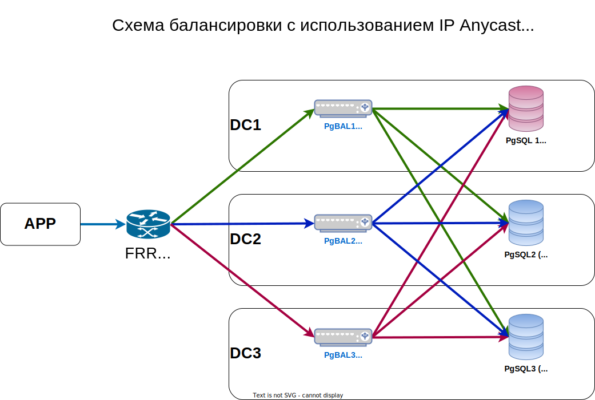

# Настройка Pgpool-II в режиме "Master-Master"

## Аннотация

В статье описан способ конфигурации PgPool-II в режиме "Master-Master" в качестве балансировщика "читающей" (SELECT) нагрузки с PostgreSQL, используя принципы [IP Anycast](https://en.wikipedia.org/wiki/Anycast) и [ECMP](https://en.wikipedia.org/wiki/Equal-cost_multi-path_routing).

## Ограничения

* Все настройки, файлы конфигураций и рекомендации приведены для дистрибутива Debian Linux, и именно для пакетов входящих в стандартную поставку Debian 11. В случае если Вы работаете с другим Linux или пакетами, то Вам будет необходимо внести изменения самостоятельно.
* Мы будем работать с PostgreSQL 13 и PgPOOL-II 4.1, проблем с другими версиями скорее всего не будет, но это не точно.
* У Вас уже должен быть настроенный кластер потоковой репликации для PostgreSQL, или Вы знаете как его сделать, в рамках статьи мы немного затронем эту тему, но абсолютно ее не раскроем. Если Вам нужны более глубокие знания, обязательно советую попасть на курс [DBA3](https://postgrespro.ru/education/courses/DBA3).
* Вам потребуются минимальные знания сетевого стэка Linux и протокола динамической маршрутизации, в частности в нашем примере мы будем использовать OSPF, но можно использовать любой другой протокол, который Вам больше нравится.

## Существующие решения для балансировки в PostgreSQL

1. PgPool-II- <https://pgpool.net>
2. PgCAT - <https://github.com/levkk/pgcat>
3. Percona - <https://www.percona.com/ha-for-postgresql>
4. Коннекторы ODBC / JDBC
5. Стандартная библиотека от PostgreSQL libpq, а у компании [PostgresPRO](https://postgrespro.ru) есть качественный [перевод](https://postgrespro.ru/docs/postgrespro/13/libpq)

Варианты 4 и 5 нам не подходят ввиду малой автоматизации из коробки, и требуют написания дополнительных обёрток, чтобы с ними работать. Другие решения нам подходят, но до конца соответствуют требованиям, которые предъявляет наша компания.

### Недостатки решений

* Независимо от количества нод для балансировки, весь трафик будет при любом сценарии идти только через одну ноду, на которой в данный момент будет находится виртуальный адрес. Все остальные ноды будут простаивать в ожидании назначения IP адреса, эти ресурсы у нас будут постоянно выделены но не будут использоваться. [схема](https://app.diagrams.net/#Uhttps://raw.githubusercontent.com/IgorAlov/pg_pool2_ng/master/support/drawio/ntwrk_02.drawio.svg)
* Если у нас несколько Дата-Центров (например: Санкт-Петербург, Москва, Екатеринбург), и по одной ноде балансировки расположено в каждом из них, то в этом случае трафик может "бегать" между городами впустую, занимая дорогостоящую полосу пропускания, в добавок к этому увеличивая время отклика самого приложения. [схема](https://app.diagrams.net/#Uhttps://raw.githubusercontent.com/IgorAlov/pg_pool2_ng/master/support/drawio/ntwrk_03.drawio.svg)
* Время переключения ("переноса") адреса в случае сценария выхода из строя одной ноды, заметное для приложения и составляет до 2-10 секунд (это зависит от конкретной конфигурации сети).

## Основа

Во всех современных сетях, нередко применяют технологию IP Anycast для распределения нагрузки. С прошлого века самым известным сервисом, который использовал anycast была служба DNS. Сегодня в современных сетях в общих случаях применяя anycast и протоколы ECMP мы можем организовать балансировку "без самого балансировщика", используя только протоколы динамической маршрутизации. Одним из таких примеров может быть сервис nginx (работающий как прокси или веб сервер), который будет принимать запросы на anycast адрес и обрабатывать их. Я оставлю [файл конфигурации](configs/etc/nginx/sites-available/nginx_ping.conf) для nginx, на случай если будет необходимо  отладить схему с балансировкой трафика. С точки зрения IP Anycast и ECMP, не должно возникнуть каких либо проблем для работы механизмов балансировки, однако транспортный протокол по которому работает PostgreSQL - TCP, и при балансировке TCP есть определенные тонкости, о которых я расскажу чуть позже.

<details>
<summary>Схема сети с использование IP Anycast</summary>


</details>

## Начальная настройка (общий случай)

Для начала определимся с конфигурацией нашей сети, и адресным пространством, которое мы будем использовать для нашего тестового стенда кластера базы данных.
|Host|IP base|IP routed|IP loopback|IP Anycast|Description|
|--:|--:|--:|--:|--:|--:|
|FRR | 198.18.0.90/24 |198.18.1.90/24|198.18.2.90/32|NA|Routing Daemon|
|PgSQL1|198.18.0.91/24|198.18.1.91/24|198.18.2.91/32|198.18.2.0/32|PostgreSQL Master|
|PgSQL2|198.18.0.92/24|198.18.1.92/24|198.18.2.92/32|NA|PostgreSQL Replica|
|PgSQL3|198.18.0.93/24|198.18.1.93/24|198.18.2.93/32|NA|PostgreSQL Replica|
|PgBAL1|198.18.0.94/24|198.18.1.94/24|198.18.2.94/32|198.18.2.0/32|PgPOOL-II Instance 1|
|PgBAL2|198.18.0.95/24|198.18.1.95/24|198.18.2.95/32|198.18.2.0/32|PgPOOL-II Instance 2|
|PgBAL3|198.18.0.96/24|198.18.1.96/24|198.18.2.96/32|198.18.2.0/32|PgPOOL-II Instance 3|

## Настройка серверов (виртуальных машин) для стенда

Для нашего тестового стенда мы создадим 7 виртуальных машин на базе Debian 11, при этом исключительно для упрощения создания тестовой среды предлагаю сделать по дополнительному сетевому интерфейсу, в ходящему в общую сеть, для  виртуальных машин, которые будут принимать участие в динамической маршрутизации (PgSQL1, PgBAL1, PgBAL2, PgBAL3 и FRR). Например, если собираете стенд в VirtualBox, то подключите второй сетевой интерфейс к Internal Network (название Internal Network в виртуальных машинах должно совпадать).

## Установка и конфигурация пакетов для всех виртуальных машин

1. `apt update && apt upgrade` - (Все VM) - обновляем  все пакеты (если вдруг у нас не свежая установка).
2. `apt install ifupdown2` - (все VM) - обновленная служба конфигурации сети, необходима для корректной работы вместе с демоном [frr](https://frrouting.org/).
3. По желанию в файл `/etc/hosts` добавляем наши адреса [пример](configs/etc/hosts) для доступа к виртуальным машинам по именам.
4. `apt install htop hping3 tcpdump curl nginx` - утилиты для удобства отладки в настройке.
5. `apt install frr` - (PgSQL1, PgBAL1, PgBAL2, PgBAL3, FRR) - демон маршрутизации.
6. `apt install postgresql` -  (PgSQL1, PgSQL2, PgSQL3) - сервер базы данных PostgreSQL.
7. `apt install pgpool2` - (PgBAL1, PgBAL2, PgBAL3) - балансировщик PgPOOL-II.
8. `apt install postgresql-client` - (FRR) - клиент для подключения к базе данных.
9. Для каждого сервера задайте имя хоста в файле `/etc/hostname` в соответствии с таблицей.

## Настройка сетевых адресов

В соответствии с таблицей нам необходимо произвести настройку сетевых интерфейсов в файле `/etc/network/interfaces` на виртуальных машиных и перезапустить службу `service networking restart`.

* IP base - опорный адрес, прописываем на первую сетевую карту (скорее всего eth0);
* IP loopback - адрес loopback, который необходимо добавить на интерфейс loopback (почти всегда lo);
* IP routed - адрес сети, который необходимо прописать на второй сетевой интерфейс для серверов  (PgSQL1, PgBAL1, PgBAL2, PgBAL3, FRR) (скорее всего eth1);
* IP Anycast - адрес, который мы *временно* (на период базовой настройки) добавим на интерфейс loopback (lo) для серверов (PgSQL1, PgBAL1, PgBAL2, PgBAL3);

<details>
<summary>Пример файла конфигурации /etc/network/interfaces</summary>

```bash
source /etc/network/interfaces.d/*

auto lo
iface lo inet loopback
    address <IP loopback>
    address <IP Anycast> # если такой адрес должен быть *(временно пропишем)
   
# опорная сеть IP base
auto eth0
iface eth0 inet static
    address <IP base>
    ip-forward off  # для сервера frr параметр должен быть on
    ip6-forward off
    arp-accept on

# ospf сеть IP routed для серверов (PgSQL1, PgBAL1, PgBAL2, PgBAL3, FRR)
auto eth1
iface eth1 inet static
    address <IP routed>
    ip-forward off  # для сервера frr параметр должен быть on
    ip6-forward off
    arp-accept on

```

</details>
Перед тем как начать производить дальнейшую настройку, нам необходимо убедится что все виртуальные машины доступны по IP адресам, которые мы для них задали. проверьте доступность машин используя команду (для всех серверов)

```bash
for addr in `seq 90 1 96`; do ping -c1 -q 198.18.0.$addr; done
```

<details>
   <summary>Вывод</summary>

```bash

--- 198.18.0.90 ping statistics ---
1 packets transmitted, 1 received, 0% packet loss, time 0ms
rtt min/avg/max/mdev = 0.025/0.025/0.025/0.000 ms
PING 198.18.0.91 (198.18.0.91) 56(84) bytes of data.

--- 198.18.0.91 ping statistics ---
1 packets transmitted, 1 received, 0% packet loss, time 0ms
rtt min/avg/max/mdev = 0.109/0.109/0.109/0.000 ms
PING 198.18.0.92 (198.18.0.92) 56(84) bytes of data.

--- 198.18.0.92 ping statistics ---
1 packets transmitted, 1 received, 0% packet loss, time 0ms
rtt min/avg/max/mdev = 0.128/0.128/0.128/0.000 ms
PING 198.18.0.93 (198.18.0.93) 56(84) bytes of data.

--- 198.18.0.93 ping statistics ---
1 packets transmitted, 1 received, 0% packet loss, time 0ms
rtt min/avg/max/mdev = 0.125/0.125/0.125/0.000 ms
PING 198.18.0.94 (198.18.0.94) 56(84) bytes of data.

--- 198.18.0.94 ping statistics ---
1 packets transmitted, 1 received, 0% packet loss, time 0ms
rtt min/avg/max/mdev = 0.103/0.103/0.103/0.000 ms
PING 198.18.0.95 (198.18.0.95) 56(84) bytes of data.

--- 198.18.0.95 ping statistics ---
1 packets transmitted, 1 received, 0% packet loss, time 0ms
rtt min/avg/max/mdev = 0.117/0.117/0.117/0.000 ms
PING 198.18.0.96 (198.18.0.96) 56(84) bytes of data.

--- 198.18.0.96 ping statistics ---
1 packets transmitted, 1 received, 0% packet loss, time 0ms
rtt min/avg/max/mdev = 0.114/0.114/0.114/0.000 ms
```

</details>

Так же на серверах с двумя сетевыми интерфейсам (PgSQL1, PgBAL1, PgBAL2, PgBAL3 и FRR) мы тоже должны убедится, что все настроено:

```bash
for addr in 90 91 94 95 96; do ping -c1 -q 198.18.1.$addr; done
```

<details>
  <summary>Вывод</summary>

```bash

PING 198.18.1.90 (198.18.1.90) 56(84) bytes of data.

--- 198.18.1.90 ping statistics ---
1 packets transmitted, 1 received, 0% packet loss, time 0ms
rtt min/avg/max/mdev = 0.009/0.009/0.009/0.000 ms
PING 198.18.1.91 (198.18.1.91) 56(84) bytes of data.

--- 198.18.1.91 ping statistics ---
1 packets transmitted, 1 received, 0% packet loss, time 0ms
rtt min/avg/max/mdev = 0.142/0.142/0.142/0.000 ms
PING 198.18.1.94 (198.18.1.94) 56(84) bytes of data.

--- 198.18.1.94 ping statistics ---
1 packets transmitted, 1 received, 0% packet loss, time 0ms
rtt min/avg/max/mdev = 0.138/0.138/0.138/0.000 ms
PING 198.18.1.95 (198.18.1.95) 56(84) bytes of data.

--- 198.18.1.95 ping statistics ---
1 packets transmitted, 1 received, 0% packet loss, time 0ms
rtt min/avg/max/mdev = 0.131/0.131/0.131/0.000 ms
PING 198.18.1.96 (198.18.1.96) 56(84) bytes of data.

--- 198.18.1.96 ping statistics ---
1 packets transmitted, 1 received, 0% packet loss, time 0ms
rtt min/avg/max/mdev = 0.129/0.129/0.129/0.000 ms
```  

</details>

## Настройка маршрутизации

После того, как мы убедились в том, что все адреса доступны, можем приступить к настройке демона маршрутизации FRR, для этого отредактируем файл [/etc/frr/daemon](configs/etc/frr/daemons) и включим OSFP параметр `ospfd=yes`, так же рекомендую включить BFD (но это не обязательно), за это отвечает параметр `bfdd=yes`. Протокол BFD позволит уменьшить время переключения маршрута (быстрее определить линк, который вышел из строя).

* Выполнить перезапуск демона FRR `service frr restart`
* Запустить `sudo vtysh` и добавить команды

```plain
interface eth1
 ip ospf bfd

router ospf
 ospf router-id 198.18.2.9X # указать адрес IP loopback (id должен быть разный для каждого сервера)
 redistribute connected
 passive-interface default
 no passive-interface eth1
 network 198.18.1.0/24 area 0
 network 198.18.2.0/24 area 0
```

* Незабудем сохранить конфигурацию -  `write memory`

## Проверка работы  маршрутизации

На сервере FRR мы должны увидеть маршруты к нашему виртуальному адресу со всех балансиров.

```bash
user@frr:~$ sudo ip route show 198.18.2.0
198.18.2.0 nhid 29 proto ospf metric 20 
        nexthop via 198.18.1.96 dev eth1 weight 1 # PgBAL1
        nexthop via 198.18.1.94 dev eth1 weight 1 # PgBAL2
        nexthop via 198.18.1.95 dev eth1 weight 1 # PgBAL3
```

при желании можно проверить доступность наших балансеров

```bash
user@frr:~$ sudo for ips in `ip route show 198.18.2.0 | awk '$2=="via" {print $3}'`;do ping -c3 $ips; done
```

<details>
  <summary>Вывод</summary>

```bash
PING 198.18.1.96 (198.18.1.96) 56(84) bytes of data.
64 bytes from 198.18.1.96: icmp_seq=1 ttl=64 time=0.390 ms
64 bytes from 198.18.1.96: icmp_seq=2 ttl=64 time=0.127 ms
64 bytes from 198.18.1.96: icmp_seq=3 ttl=64 time=0.124 ms

--- 198.18.1.96 ping statistics ---
3 packets transmitted, 3 received, 0% packet loss, time 2051ms
rtt min/avg/max/mdev = 0.124/0.213/0.390/0.124 ms
PING 198.18.1.94 (198.18.1.94) 56(84) bytes of data.
64 bytes from 198.18.1.94: icmp_seq=1 ttl=64 time=0.126 ms
64 bytes from 198.18.1.94: icmp_seq=2 ttl=64 time=0.109 ms
64 bytes from 198.18.1.94: icmp_seq=3 ttl=64 time=0.143 ms

--- 198.18.1.94 ping statistics ---
3 packets transmitted, 3 received, 0% packet loss, time 2045ms
rtt min/avg/max/mdev = 0.109/0.126/0.143/0.013 ms
PING 198.18.1.95 (198.18.1.95) 56(84) bytes of data.
64 bytes from 198.18.1.95: icmp_seq=1 ttl=64 time=0.129 ms
64 bytes from 198.18.1.95: icmp_seq=2 ttl=64 time=0.138 ms
64 bytes from 198.18.1.95: icmp_seq=3 ttl=64 time=0.121 ms

--- 198.18.1.95 ping statistics ---
3 packets transmitted, 3 received, 0% packet loss, time 2046ms
rtt min/avg/max/mdev = 0.121/0.129/0.138/0.007 ms
```

</details>

## Несколько слов про Equal-Cost Multi-Path routing (ECMP) и Five-Tuple

После того как мы получили маршруты, к нашему виртуальному адресу `198.18.2.0`, доступные через разные next-hop'ы., нам необходимо "согласовать правила игры", по которым пакеты будут распределятся между ними.
Правила игры - обычно набор из пяти параметров полей Ethernet кадра или IP пакета - Five Tuple, управляя которыми можно добиваться необходимой балансировки пакетов, конкретно для нашего случая.

**NB!** Прошу обратить внимание, что в нашем случае мы используем TCP пакеты, и нам важно, чтобы балансировка используемая нами работала не в режиме Per Packet, а в режиме Per Flow, это необходимо нам для того чтобы избежать возможных проблем с TCP.  (например исключить возможность отправки пакетов одного IP-Flow на резные next-hops. TCP-SYN пакета в сторону одного next-hop, а скажем TCP-PUSH уже в сторону другого next-hop). В современном оборудовании чаще по умолчанию используется именно Per Flow, а чтобы включить Per Packet - надо постараться.

В оборудовании Juniper, в современных версиях JunOS, настройка политики load-balance Per-Packet - все равно означает балансировку Per Flow. [подробнее](https://www.juniper.net/documentation/us/en/software/junos/sampling-forwarding-monitoring/topics/concept/policy-configuring-per-packet-load-balancing.html).

Если Вы используете Mikrotik, то скорее всего в документации найти параметры 5-Tuple будет не просто. В этом случае рекомендую ознакомится с интересной [презентацией](https://mum.mikrotik.com/presentations/RU19R/presentation_6827_1553517470.pdf) по настройке MultiWAN  Васильева Кирилла из [Mikrotik.me](https://microtik.me), на 59ой странице будет представлена вся необходимая информация

Мы, в качестве роутера на нашем стенде используем Linux и пакет FRR.  За работу ECMP отвечают всего два параметра `fib_multipath_use_neigh` и `fib_multipath_hash_policy` [подробнее в документации](https://www.kernel.org/doc/Documentation/networking/ip-sysctl.txt). создадим файл конфигурации sysctl [ip-hash-l4](/configs/etc/sysctl.d/ip-hash-l4.conf) в директории `/etc/sysctl.d` и применим его

```bash
user@frr:~$ sudo sysctl -p /etc/sysctl.d/ip-hash-l4.conf 
```

## Проверим работу ECMP используя nginx

Возьмем простой [файл](/configs/etc/nginx/sites-available/nginx_ping.conf) конфигурации для nginx, который поможет нам протестировать корректность работы ECMP, перед тем как мы приступим к конфигурации Pgpoll-II. Установим его на сервера PgBAL1, PgBAL2, PgBAL3.

```bash
server {
    listen 80 default_server;

    return 200 " >>>> $hostname [ $server_addr:$server_port ] FROM [ $remote_addr:$remote_port ]\n";
}
```

С сервера FRR выполним несколько запросов к нашему виртуальному адресу `198.18.2.0` по порту TCP/80

```bash
user@frr:~$ for i in `seq 1 1 10`; do curl http://198.18.2.0; done
```

<details>
<summary>Вывод</summary>

```bash
 >>>> bgbal3 [ 198.18.2.0:80 ] FROM [ 198.18.1.90:56076 ]
 >>>> bgbal1 [ 198.18.2.0:80 ] FROM [ 198.18.1.90:56078 ]
 >>>> bgbal1 [ 198.18.2.0:80 ] FROM [ 198.18.1.90:56084 ]
 >>>> bgbal1 [ 198.18.2.0:80 ] FROM [ 198.18.1.90:56098 ]
 >>>> bgbal3 [ 198.18.2.0:80 ] FROM [ 198.18.1.90:56102 ]
 >>>> bgbal3 [ 198.18.2.0:80 ] FROM [ 198.18.1.90:56108 ]
 >>>> bgbal1 [ 198.18.2.0:80 ] FROM [ 198.18.1.90:56124 ]
 >>>> bgbal2 [ 198.18.2.0:80 ] FROM [ 198.18.1.90:56128 ]
 >>>> bgbal3 [ 198.18.2.0:80 ] FROM [ 198.18.1.90:56136 ]
 >>>> bgbal2 [ 198.18.2.0:80 ] FROM [ 198.18.1.90:56146 ]
 ```

</details>

Если балансировка работает исправно то мы увидим, что по адресу `198.18.2.0` нам отвечают разные сервера (hostname), и если все так, то мы готовы приступить к настройке PgPool.

## Настройка Pgpool-II

Прежде чем настраивать Pgpool-II, нам необходимо подготовить PostgreSQL и настроить две потоковые реплики, подразумевается что Вы это умеете делать, или у Вас уже собран такой стенд. Если стенда нет, то рекомендую взять [демонстрационную базу данных](https://postgrespro.ru/education/demodb) с сайта компании PostgresPro, накатить ее на установленный сервер PostgreSQL, и уже с него сделать две реплики. Для помощи в создании реплики обратитесь к [курсу DBA-3](https://edu.postgrespro.ru/dba3-13/dba3_04_replica_physical.html). После необходимо убедится что и мастер и реплики доступны с нашего тестового окружения.

Итак, настраиваем конфигурационные файлы [pcp.conf](/configs/etc/pgpool2/pcp.conf), [pgpool_hba.conf](/configs/etc/pgpool2/pgpool_hba.conf), [pool_passwd](/configs/etc/pgpool2/pool_passwd) и [pgpool.conf](/configs/etc/pgpool2/pgpool.conf) для серверов PgBAL1, PgBAL2 и PgBAL3 - все они будут идентичными, так как каждая из наших нод будет работать как мастер нода, и будет считать, себя главной. Наличие дополнительных связей между серверами PgBAL не требуется в отличие от реализации с "перемещением" виртуального адреса между нодами.

**NB!** для простоты конфигурации логин и пароль заданы как `postgres` и `psql`, такой же пользователь используется и для доступа к базам данных. При использовании в продакшене  такое сочетание использовать крайне не рекомендуется.

### Файлы конфигурации Pgpool-II

* pcp.conf - используется для авторизации утилит управления Pgpool-II;
* pgpool_hba.conf - эквивалент файла pg_hba.conf, используется для авторизации клиентов, запросы которых поступают на pgpool;
* pool_passwd - файл, в котором хранятся параметры доступа к самой базе данных (с этими правами pgpool будет ходить в базу данных);
* pgpool.conf - основной файл конфигурации Pgpool-II;

### Основные параметры файла pgcool.conf требующие внимания при настройке балансировщика в режиме "Master-Master"

* `backend_*` - конфигурация backend'ов
    <details>
    <summary>Пример</summary>

    ```bash
    backend_hostname0 = '198.18.0.91'
    backend_port0 = 5432
    backend_weight0 = 1
    backend_data_directory0 = '/var/lib/pgsql/data1'
    backend_flag0 = 'ALLOW_TO_FAILOVER'
    backend_application_name0 = 'psql1'

    backend_hostname1 = '198.18.0.92'
    backend_port1 = 5432
    backend_weight1 = 1
    backend_data_directory1 = '/var/lib/pgsql/data2'
    backend_flag1 = 'ALLOW_TO_FAILOVER'
    backend_application_name1 = 'psql2'

    backend_hostname2 = '198.18.0.93'
    backend_port2 = 5432
    backend_weight2 = 1
    backend_data_directory2 = '/var/lib/pgsql/data3'
    backend_flag2 = 'ALLOW_TO_FAILOVER'
    backend_application_name2 = 'psql3'
    ```

    </details>
* `white_function_list = 'pg_read_file,inet_client_addr'` - "белый" список функций, которым будет доступна балансировка. Эти две функции нам будут необходимы в процессе тестирования балансеров, чтобы понимать какой сервер нам отвечает.
* `master_slave_mode = on` - включаем режим работы с базой данных master-slave, что позволит нам следить за отставанием реплики, и своевременно исключить бэкенд из балансировки;
* `master_slave_sub_mode = 'stream'` - режим в котором работает реплика, в данном случае режим потоковой репликации;
* `follow_master_command` -  шел команда, которая выполняется когда **мастер** отказал;
* `failover_command` - шел команда выполняемая в случае отказа одного из бэкэндов;
* `failback_command` - шел команда выполняемая в случае возвращения в работу ранее отказавшего бэкэнда;
* `logdir = '/var/log/postgresql'` - директория в которой pg_pool хранит файл `pgpool_status` с состоянием бэкендов;

### Проверка работоспособности

Для проверки работоспособности балансеров, мы будем подряд делать несколько запросов с функциями `pg_read_file()`, чтобы прочитать файл `/etc/hostname`, на сервере базы данных и функцию `inet_client_addr()`, чтобы получить информацию об адресе c которого  балансера мы подключились

```bash
for i in `seq 1 20`; do psql -U postgres -h 198.18.2.0 -c "select pg_read_file('/etc/hostname') host,inet_client_addr() addr"; done
 ```

<details>
<summary>Вывод</summary>

```bash
 host  |    addr     
-------+-------------
 psql3+| 198.18.0.95
       | 
(1 row)

Time: 4.963 ms
 host  |    addr     
-------+-------------
 psql3+| 198.18.0.95
       | 
(1 row)

Time: 0.841 ms
 host  |    addr     
-------+-------------
 psql1+| 198.18.0.96
       | 
(1 row)

Time: 2.726 ms
 host  |    addr     
-------+-------------
 psql3+| 198.18.0.94
       | 
(1 row)

Time: 0.814 ms
 host  |    addr     
-------+-------------
 psql2+| 198.18.0.96
       | 
(1 row)

Time: 4.861 ms
 host  |    addr     
-------+-------------
 psql1+| 198.18.0.94
       | 
(1 row)

Time: 0.790 ms
 host  |    addr     
-------+-------------
 psql2+| 198.18.0.95
       | 
(1 row)

Time: 0.789 ms
 host  |    addr     
-------+-------------
 psql1+| 198.18.0.96
       | 
(1 row)

Time: 0.832 ms
 host  |    addr     
-------+-------------
 psql3+| 198.18.0.94
       | 
(1 row)

Time: 0.866 ms
 host  |    addr     
-------+-------------
 psql1+| 198.18.0.94
       | 
(1 row)

Time: 0.803 ms
 host  |    addr     
-------+-------------
 psql3+| 198.18.0.94
       | 
(1 row)

Time: 0.756 ms
 host  |    addr     
-------+-------------
 psql3+| 198.18.0.95
       | 
(1 row)

Time: 0.819 ms
 host  |    addr     
-------+-------------
 psql2+| 198.18.0.96
       | 
(1 row)

Time: 0.721 ms
 host  |    addr     
-------+-------------
 psql1+| 198.18.0.94
       | 
(1 row)

Time: 0.784 ms
 host  |    addr     
-------+-------------
 psql2+| 198.18.0.96
       | 
(1 row)

Time: 0.817 ms
 host  |    addr     
-------+-------------
 psql1+| 198.18.0.94
       | 
(1 row)

Time: 0.829 ms
 host  |    addr     
-------+-------------
 psql3+| 198.18.0.94
       | 
(1 row)

Time: 0.750 ms
 host  |    addr     
-------+-------------
 psql2+| 198.18.0.94
       | 
(1 row)

Time: 0.799 ms
 host  |    addr     
-------+-------------
 psql1+| 198.18.0.94
       | 
(1 row)

Time: 0.768 ms
 host  |    addr     
-------+-------------
 psql1+| 198.18.0.95
       | 
(1 row)

Time: 0.783 ms
```

</details>

исходя из полученных данных  при тестирования мы видим что у нас все работает так как мы и хотели. Мы используем все три балансера [`198.18.0.94`, `198.18.0.95`, `198.18.0.96`], и подключаемся через них к серверам [`psql1`, `psql2`, `psql3`].

### PGPool-II Важные замечания

Настроенный Pgpool-II работает, так как надо, однако есть несколько моментов, которые мы должны исправить прежде, чем запустить в эксплуатацию. Эти сложности были выявлены в процессе тестирования, в погоне за желанием "все сломать".

1. Нам необходимо сделать так, чтобы маршрут к адресу `198.18.2.0` с next-hop был анонсирован только в том случае, если приложение Pgpool-II работает. А если приложение перестало по каким либо причинам работать, то такой адрес должен быть не немедленно  удален из анонсов. В этом нам поможет system.d, службу можно сконфигурировать таким образом, что при старте приложения будет автоматически добавляется адрес на локальный интерфейс , а если это приложение вдруг перестало работать (в том числе и было "убито" `kill -KILL`), то обязательно удалить адрес с локального интерфейса.
2. Когда PGppol-II определяет внезапно отказавшего master бэкэнд, то не смотря на то, что у нас могут быть доступны бэкенды реплики, мы хотим убрать маршрут к адресу `198.18.2.0` с нашим next-hop. Пусть запросы идут на другой рабочий балансер;
3. В процессе эксплуатации было обнаружено интересное поведение: если master бэкенд был недоступен, и в это время сервис pgpool2 был перезапущен, то pgpool2 никогда не будет работать, однако если файл со статусом удалить, и запустить снова, то сервис будет работать. Поэтому перед запуском необходимо проверять файл состояний, и если состояние матер бэкэнд было `down`, то мы просто удаляем файл pgpool_status. В этом случае, при старте pgpool2 создаст файл заново, и если на текущий момент мастер все еще не работает, то нода будет отключена, и через некоторое время сервис снова будет проверять состояние мастера, до тех пор пока мастер не будет запущен в работу, ну или сервис pgpool1 снова не перезагрузят.

Исходя из выше сказанного родился скрипт [manage.sh](/configs/etc/pgpool2/manage.sh), для управления добавлением и удалением адресов, а так же контроля за файлом pool_status
<details>
<summary>код</summary>

```bash
#!/bin/bash

BIN_RM=/usr/bin/rm
BIN_IP=/usr/sbin/ip
BIN_ECHO=/usr/bin/echo
BIN_GREP=/usr/bin/grep
BIN_HEAD=/usr/bin/head
BIN_TEST=/usr/bin/test
BIN_LOGGER=/usr/bin/logger

CFG_ID=0
CFG_IF=lo
CFG_IP=198.18.2.0/32
CFG_PS=/var/log/postgresql/pgpool_status

MSG=""

if [ $# -ne 2 ]; then
    ${BIN_ECHO} "USAGE ${0} (action) (num)"
    exit 0
fi

if [ "${2}" == "${CFG_ID}" ]; then
    case "${1}" in
        add)
            if [ ! -r ${CFG_PS} ] || [ "up" == `${BIN_HEAD} -n1 ${CFG_PS}` ]; then
                MSG="Addr ${CFG_IP} adding"
                ${BIN_IP} -br address show dev ${CFG_IF} | ${BIN_GREP} -qc1 ${CFG_IP} || ${BIN_IP} address add ${CFG_IP} dev ${CFG_IF}
            else
                MSG="Skip adding address"
            fi
            ;;
        del)
            MSG="Addr ${CFG_IP} removing"
            ${BIN_IP} -br address show dev ${CFG_IF} | ${BIN_GREP} -qc1 ${CFG_IP} && ${BIN_IP} address del ${CFG_IP} dev ${CFG_IF}
            ;;
        clean)
            MSG="Clean file ${CFG_PS}"
            ${BIN_TEST} -w ${CFG_PS} && ${BIN_TEST} "up" != `${BIN_HEAD} -n1 ${CFG_PS}` && ${BIN_RM} ${CFG_PS}
            ;;
        *)
            MSG="wrong action"
            ${BIN_ECHO} "action could be add or del"
            ;;
    esac
fi

${BIN_LOGGER} "pgpool2:${0}, ACT: ${1}, ID: ${2}, MSG: ${MSG}"

exit 0

```

</details>

Добавим вызов файла manage.sh из соответствующих директив файла pgpool.conf

```bash
follow_master_command = '/etc/pgpool2/manage.sh del %d'
failover_command = '/etc/pgpool2/manage.sh del %d'
failback_command = '/etc/pgpool2/manage.sh add %d'
```

Создадим файл конфигурации [loopback.conf](/configs/lib/systemd/system/pgpool2.service.d/loopback.conf) для сервиса Pgppol2 в отдельной папке pgpool2.service.d, чтобы исключить перезапись файла, при обновлении версии pgpool2. обратим внимание на некоторые строки файла:

* `AmbientCapabilities=CAP_NET_ADMIN` - так как пользователь, под которым запускается PgPool-II не имеет root прав, то для того чтобы сервис мог добавить адрес на интерфейс без них, нужно добавить соответствующую расширение прав пользователя;
* `ExecStartPre=/etc/pgpool2/manage.sh clean 0` - команда выполняется, перед запуском сервиса (проверяем файл pool_status);
* `ExecStartPost=/etc/pgpool2/manage.sh add 0` - команда которая выполняется после запуска сервиса (добавляем IP адрес);
* `ExecStopPost=/etc/pgpool2/manage.sh del 0` - команда которая выполняется после завершения работы сервиса (удаляем IP адрес);

Ну и теперь мы можем смело удалить адрес `198.18.2.0` ил файла `/etc/network/interfaces, так как этим адресом мы управляем из system.d и самого pgpool.

### Бонус к надежности

  На самом деле, я рекомендую так же установить и настроить FRR на master Postgres, но изменив метрику, так чтобы  маршрут анонсированный мастером проигрывал любому другому анонсу приходящему от балансеров. В случае если все балансеры выйдут из строя, и от них не будет поступать анонсов, то пакеты пойдут напрямую на master [схема](https://app.diagrams.net/#Uhttps://raw.githubusercontent.com/IgorAlov/pg_pool2_ng/master/support/drawio/ntwrk_06.drawio.svg). Нагрузка в таком случае может быть очень большая, однако, конфигурируя файл pg_hba.conf на самом мастере Вы можете ограничить доступ только до определенных самых критически важных приложений.
